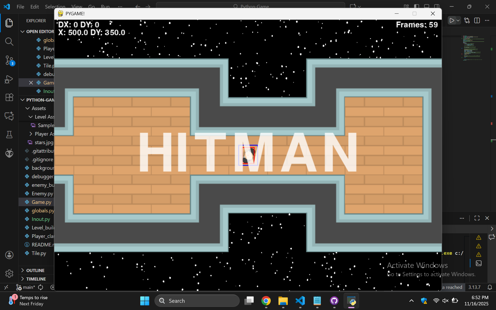

# Python Game
My game files for a pyhton based game

Tasks:
  - [x] Level Creation
  - [x] Movement
  - [x] Background
  - [x] Look Physics
  - [x] Level Collision
  - [ ] Enemies
  - [ ] Score Counter
  - [ ] Health bar
  - [ ] load image

